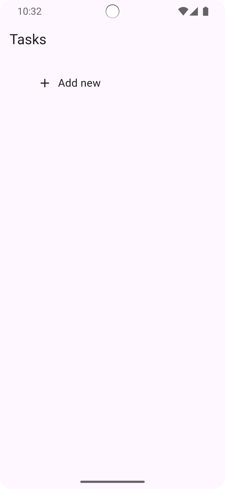
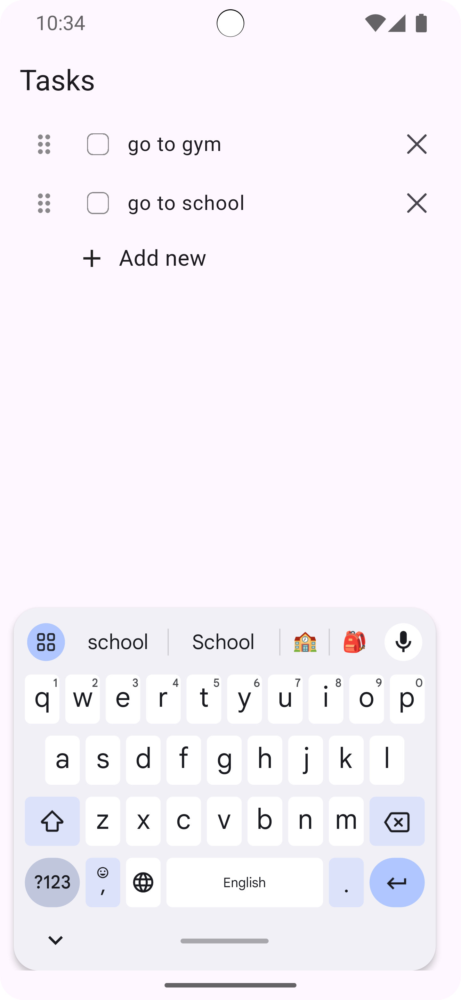
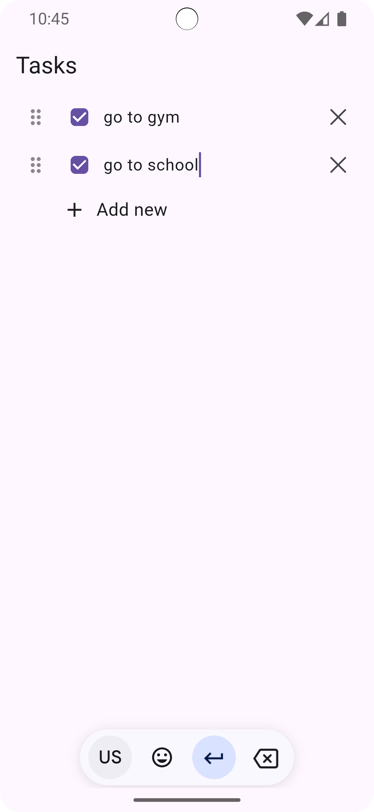

# Tasks - To-Do List App 📝

A simple and clean to-do list mobile application built with Flutter. This app helps you organize your daily tasks with an intuitive interface and essential task management features.

## ✨ Features

- ✅ **Add Tasks**: Quickly add new tasks to your list
- ✏️ **Edit Tasks**: Modify task descriptions inline
- ☑️ **Mark Complete**: Check off completed tasks
- 🗑️ **Delete Tasks**: Remove tasks you no longer need
- 🎯 **Drag Handle**: Visual indicator for potential reordering (UI ready)
- 📱 **Clean UI**: Simple and intuitive user interface

## 💡 How to Use

1. **Add a Task**: Tap the "Add new" button at the bottom to create a new task
2. **Edit a Task**: Tap on any task text to edit it
3. **Mark as Complete**: Tap the checkbox next to a task to mark it as complete
4. **Delete a Task**: Tap the × icon on the right to remove a task

## 🛠️ Technologies Used

- **Flutter**: Cross-platform mobile framework
- **flutter_bloc**: State management with BLoC pattern
- **Dart**: Programming language

## 📸 Screenshots

<div align="center">
  
  
  
</div>

## 🏗️ Architecture

The app follows a clean architecture pattern with BLoC for state management:

```
lib/
├── model/
│   └── task_model.dart          # Task data model
├── view/
│   ├── tasks_view.dart          # Main screen
│   └── widgets/
│       ├── add_task_widget.dart # Add task button
│       └── custom_check_box_tile.dart # Task item widget
└── viewmodel/
    ├── tasks_cubit.dart         # Business logic
    └── tasks_state.dart         # State definitions
```

## 🚀 Getting Started

### Prerequisites

- Flutter SDK (3.10.1 or higher)
- Dart SDK
- Android Studio / VS Code with Flutter extensions
- iOS Simulator (for Mac) or Android Emulator

### Installation

1. **Clone the repository**
   ```bash
   git clone https://github.com/ahmedasaber/tasks.git
   cd tasks
   ```

2. **Install dependencies**
   ```bash
   flutter pub get
   ```

3. **Run the app**
   ```bash
   flutter run
   ```

## 📱 Download the App

### Android
[](YOUR_PLAY_STORE_LINK_HERE)

### iOS
[](YOUR_APP_STORE_LINK_HERE)

> **Note**: Replace `YOUR_PLAY_STORE_LINK_HERE` and `YOUR_APP_STORE_LINK_HERE` with your actual app store links.

## 🧪 Testing

Run the tests using:
```bash
flutter test
```

## 🔨 Build for Production

### Android
```bash
flutter build apk --release
```

### iOS
```bash
flutter build ios --release
```

## 📦 Dependencies

- `flutter_bloc: ^9.1.1` - State management
- `cupertino_icons: ^1.0.8` - iOS-style icons

## 🤝 Contributing

Contributions are welcome! Please feel free to submit a Pull Request.

1. Fork the project
2. Create your feature branch (`git checkout -b feature/AmazingFeature`)
3. Commit your changes (`git commit -m 'Add some AmazingFeature'`)
4. Push to the branch (`git push origin feature/AmazingFeature`)
5. Open a Pull Request

## 📝 License

This project is open source and available under the [MIT License](LICENSE).

## 👨‍💻 Author

**Your Name**
- GitHub: [ahmedasaber](https://github.com/ahmedasaber)
- LinkedIn: [Ahmed Ashraf](https://linkedin.com/in/ahmedashrafsaber)

## 🙏 Acknowledgments

- Flutter team for the amazing framework
- flutter_bloc for state management solution
- Icons from Material Design and Cupertino

---

<div align="center">
  Made with ❤️ using Flutter
</div>
